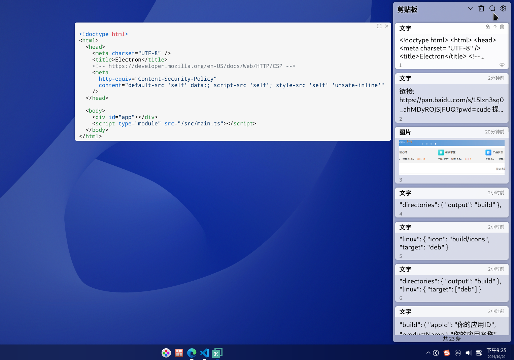

\*\*\*\*# clip

A cross-platform clipboard management software.

Shortcut: `ctrl+shift+v`

### Screenshot



## Recommended IDE Setup

- [VSCode](https://code.visualstudio.com/) + [ESLint](https://marketplace.visualstudio.com/items?itemName=dbaeumer.vscode-eslint) + [Prettier](https://marketplace.visualstudio.com/items?itemName=esbenp.prettier-vscode) + [Volar](https://marketplace.visualstudio.com/items?itemName=Vue.volar) + [TypeScript Vue Plugin (Volar)](https://marketplace.visualstudio.com/items?itemName=Vue.vscode-typescript-vue-plugin)

## Project Setup

### Install

```bash
$ npm install
```

### Development

```bash
$ sudo chmod 777 node_modules/clipboard-event/platform/clipboard-event-handler-linux
$ npm run dev
```

### Build

```bash
# For windows
$ npm run build:win

# For macOS
$ npm run build:mac

# For Linux
$ npm run build:linux
```
